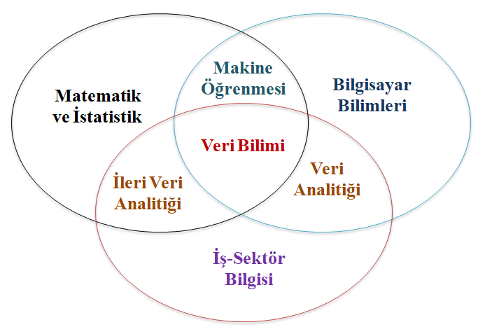
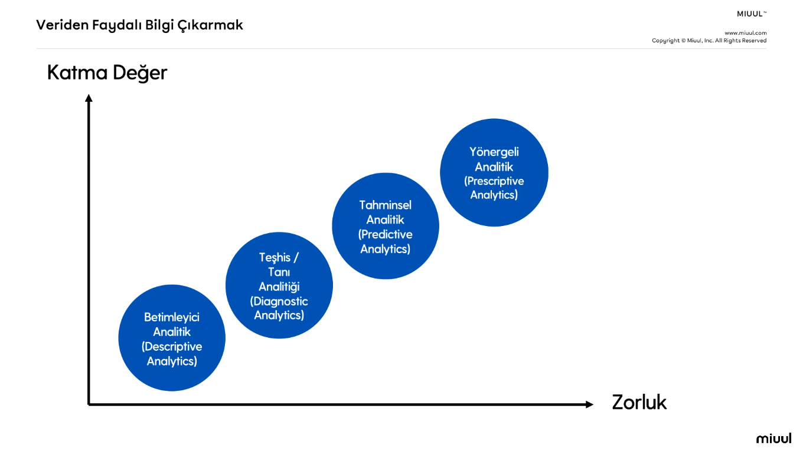
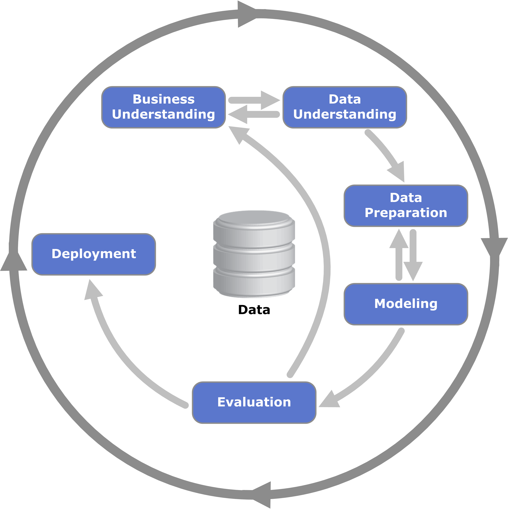
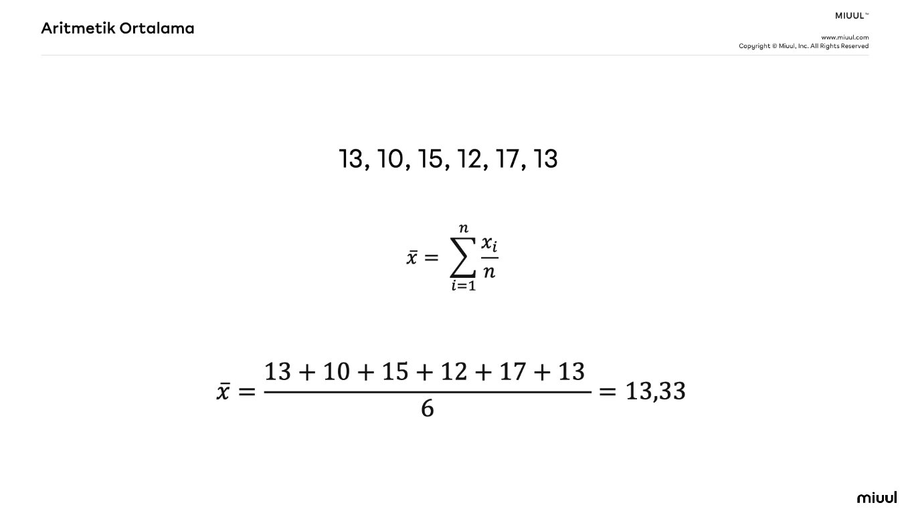
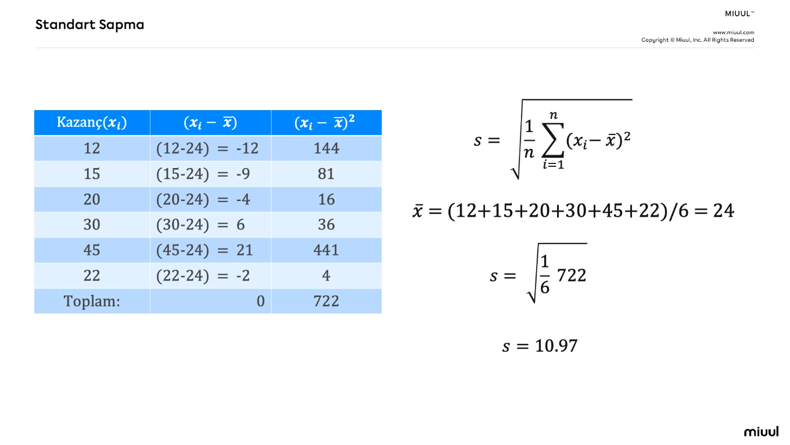
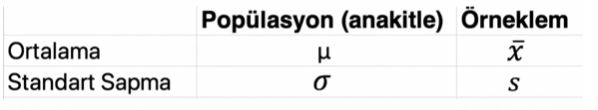
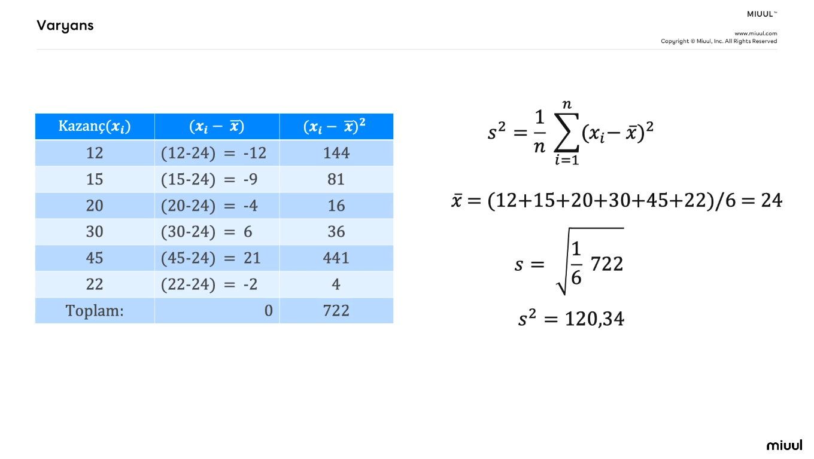
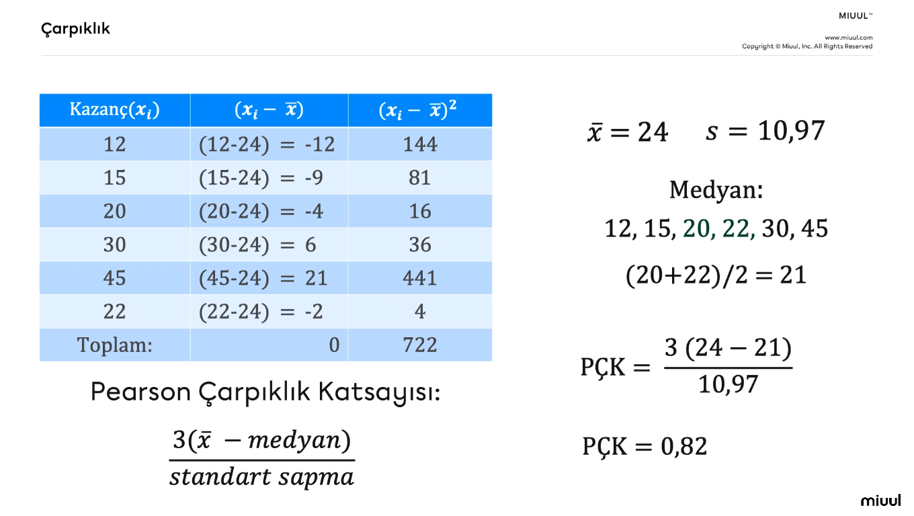
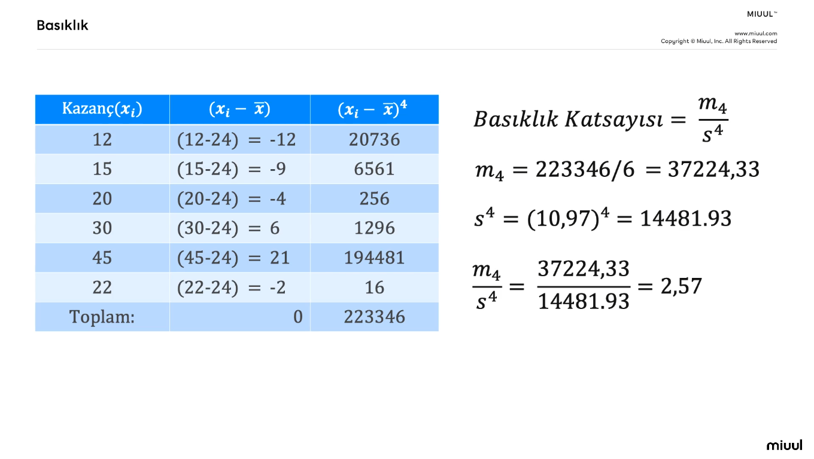

# Introduction to Data Science and Artificial Intelligence (Veri Bilimi ve Yapay Zekaya Giriş)

---

### Introduction to Data Science and Artificial Intelligence (Veri Bilimi ve Yapay Zekaya Giriş)

**Yapay Zeka Çağı ?**

> "Dünyanın en değerli kaynağı artık petrol değil veridir!" The Economist

> "Yapay zeka yeni elektriktir!" Andrew NG

---
**Yapay Zeka:** Bir bilgisayarın veya bilgisayar kontrolündeki bir robotun çeşitli faaliyetleri zeki canlılara benzer şekilde yerine getirme kabiliyetidir.

**Yapay zeka çalışmaları için örnekler:**
- Arkadaş önerileri
- Otomatik fotoğraf etiketlemeleri
- Hedefli içerik pazarlama
- Otomatik mesaj tamamlama
- Hedefli ürün pazarlama
- Tavsiye sistemleri
- Müşteri segmentasyonu
Farklı alanlar için örnekler:
- Kanser/Hastalık teşhisi
- Şirketlerin gelir tahmini iler strateji belirlemesi
- Başvuru değerlendirme sistemleri (e.g. kredi başvuruları - başvuran kişi bu krediyi ödeyebilir mi? sorusun cevap tahmininde bulunur)
- Akıllı portföy yönetimi
- Doğal afet modelleme çalışmaları
- E-spor analitiği
Görüntü işleme temelli uygulamalar:
- Otonom araçlar
- Nesne tanıma / takip uygulamaları
- Sahte videolar (deep fake videos)
- Eski resimlerin canlandırılması
- Algoritmaların geliştirdiği resimler / var olmayan kişiler (e.g. thispersondoesnotexist.com)
- Robotlar!

**Yapay zeka çağında hayatta kalmak ?**
Programlama, Matematik, İstatistik, Veri Analizi, Veri Bilimi, Büyük Veri, Yapay Zeka, Derin Öğrenme, Makine Öğrenmesi, Nesnelerin İnterneti, Endüstri 4.0, Veri Madenciliği ... kavramları ile karşılaşılmaktadır.
Veri Analitiği (bütüncül anlamda bir değer üretmek) ve Analitik Düşünce (veri bilimi ve veri analitiği kapsamında iletilecek olan değerlerdeki kişisel potansiyel) Becerileri ile bu çağa ayak uydurabiliriz. 
Üreten pozisyonunda olmak için şu açılar güçlendirilmeli:
- Yeni sorular sormak
- Araştırma
- Problem çözme
- Kavramların mantıklarına odaklanmak

**Sizi sizden daha iyi tanıyan algoritmalar:**
- Cambridge Analytica (ABD eyaletlerinde bulunanların yani personaların duygu durumlarını istatistiksel çalışmaları) + Analitik Beceriler & Veri Analitik = Dinamik bir strateji

---
**Veri Bilimi ve Veri Bilimcilik**

`Veri Kaynakları -> Veri Analitiği -> Bilgi -> Aksiyon`

Yapay zeka ürünlerini genel anlamda kimler geliştiriyor? **Veri Bilimcileri**

Bu ürünlerin geliştirme sürecini bütüncül olarak ele alan konu **Veri Bilimi** konusudur.

Ve bu ürünlerin geliştirilmesi için teorik altyapıyı sağlayan algoritmalara **Makine Öğrenmesi Algoritmaları** denir.

Örnek uygulamaların ürünleşip hayatımıza dahil olduğu son hali ise **Yapay Zeka**dır.

**Matematik & İstatistik** -> Temel Matematik, Hipotez Testleri, Veri Görselleştirme, İstatistiksel Modelleme, Makine Öğrenmesi, ...

**Bilgisayar Bilimleri** -> Programlama Dilleri (R, Python,...), Veri Tabanları (SQL, NoSQL, NewSQL), Optimzasyon Yöntemleri, Makine Öğrenmesi, Açık Kaynak Dünyası, Büyük Veri Araçları, Bulut Sistemleri, ...

**İş-Sektör Bilgisi** -> Sektör Bilgisi, Tutku, Problem Çözme Kabiliyeti, Hacker Bakış Açısı, Yenilikçilik, Hikayeleştirme, ...

---
**Veriden faydalı bilgi çıkarmak (veri bilimi)**

Zorluk arttıkça kullanılacak analitik türünün de katma değeri de artmaktadır.

**Betimleyici Analitik:** Ne olmuş? sorusuna yanıt aranır. Örneğin, bir veri seti üzerinde ortalama, medyan, mod, standart sapma vs. gibi durum incelemesi yaparak verinin durumunun betimlenmesi, görsel raporun sunulması.

**Teşhis / Tanı Analitiği:** Neden olmuş? Nasıl olmuş? sorusuna yanıt arar. Örneğin, görsel raporda bir düşüş durumunda bu durumun neden kaynaklandığı üzerinde yapılan çalışmalar.

**Tahminsel Analitik:** Ne olacak? sorusuna yanıt aranır. Nihaii sonucu bilinmeyen durumlarda tahminler yapmak için kullanılan analitiktir. Örneğin, gelecek üç ayda satışlar ne olacak durumunun araştırılması.

**Yönergeli Analitik:** Nasıl olmalı, ne olmalı sorusuna cevap verir. Örneğin, tahmin yapıldıktan sonra bu tahminleri gerçekleştirmek için ne yapılmalı sorusu tartışılır.

---
**İş Anlayışı - İş Problemi**

Image ref. https://es.wikipedia.org/wiki/Cross_Industry_Standard_Process_for_Data_Mining

Veri kullanılarak;

`İş problemini anlamak -> Veriyi anlamak -> Verinin hazırlanması -> Modelleme -> Değerlendirme -> Kullanıma sunma`

**Veriyi anlamak:** Eldeki verinin içeriğini anlamak

**Verinin hazırlanması:** Modellemeye girecek verileri modelin ihtiyacına göre hazırlanması (missing value, noise, ...)

**Modelleme:** Tahmini değerleri bulmak için (e.g. matematiksel) bir ifade oluşturmak

**Değerlendirme:** Gerçek değerler vs Tahmini değerler (var olan verilerde deneme yapılır ve tahminin ne kadar doğru olduğu tartışılır)

**Kullanıma sunma:** Model, değerlendirmeden geçerse uygulamalarda kullanılır

---

### Data Literacy (Veri Okuryazarlığı)

**Veri Okuryazarlığı:** Günlük hayatta veriyle temas ettiğimiz ilk anlardaki basit veri yorumlama kabiliyetidir.

> Veri okuryazarlığı: her türden veri tipini, değişken ve ölçek türlerini tanımlayabilme, betimsel istatistikleri ve istatistiksel grafikleri kullanarak veri değerlendirebilme yeteneğidir.

Gerçek hayatta nerede veri okuryazarlığı:
- Bakkalın satışlarını not ettiği defteri
- Bir şirkette rapor vermek 
- Seçim sonuçlarını sunmak
- Borsa ile ilgilenmek

Veri okuryazarlığını en önemli bileşeni **veri görselleştirme**dir. İfadeleri sunabiliyor olmak gerekir. Binlerce veriyi bir resim ile sunabilmek en önemli durumdur.

> Bir resim, bin kelimeye bedeldir.

---
**Temel Kavramlar**

**Popülasyon:** İlgilenilen ana kitleye (hedef kitle) denir.

**Örneklem:** Popülasyon içerisinde seçilen alt kümedir.

> Örneklemin popülasyonun niteliklerini temsil etmesi ve yansız olması gerekmektedir.

**Gözlem Birimi:** Araştırmada incelediğimiz birimlerdir. Örneğin, incelenen her bir birey, her bir satır ...

**Değişken:** Birimden birime (satırdan satıra, kişiden kişiye, ...) farklı değerler alan niceliktir.

**Değişken Türleri**

- Sayısal Değişkenler (nicel, kantitatif)
- Kategorik Değişkenler (nitel, kalitatif)

> "Cinsiyet" kategorik değişkendir. "Kadın", "Erkek" ise bu kategorik değişkenin sınıflarıdır.

**Ölçek Türleri:**

- Sayısal değişkenler için:

**Aralık:** Başlangıç noktası sıfır _olmayan_ sayısal değişkenlerin ölçek türüdür. 
**Oran:** Başlangıç noktasını sıfır _kabul eden_ sayısal değişkenlerin ölçek türüdür.

- Kategorik değişkenler için: 

**Nominal:** Sınıfları arasında bir fark olmadığında nominaldir. Örneğin, "Cinsiyet" kategorik değişkendir. "Kadın" ve "Erkek" ise bu kategorik değişkenin
sınıflarıdır. Bu sınflar arasında fark olmadığı için bu değişken nominal ölçek türüne sahiptir.
**Ordinal:** Sınıflar arasında fark vardır. Örneğin, "Rütbe" kategorik bir değişkendir. Bu kategorik değişkenin sınıfları "Onbaşı", "Yüzbaşı", "Binbaşı" ve "Albay"dır. Ama bu sınıflar arasında bir seviye (Onbaşı<Yüzbaşı<Binbaşı<Albay) mevcuttur.
Değişken sınıfları arasında fark olduğundan "Rütbe" değişkeni ordinaldir. "Eğitim Durumu" değişkeni de örnek verilebilir.

---
**Merkezi Eğilim Ölçüleri**

**Merkezi Eğilim** için önemli iki nokta:
1) Temsil yönünü kavramak
2) Doğru kullanılması

**Aritmetik Ortalama:** Bir seride (değişkende) yer alan tüm değerlerin toplanması ve birim sayısına bölünmesi ile elde edilen istatistiktir. Verilerdeki merkezi eğilimi gösterir.

**Medyan:** Bir seriyi küçükten büyüğe veya büyükten küçüğe sıraladığımızda tam orta noktadan seriyi iki eşit parçaya ayıran değere denir.

n -> medyanı bulunmak istenen elemanların sayısı

n tek ise:
> Medyan = ( (n+1) / 2 ).terim

n çift ise: 
> Medyan = ( (n/2).terim + (n/2 + 1).terim ) / 2

n tek olduğunda ortadaki değer direkt alınır, çift olduğunda ortada kalan iki değerin ortalaması alınır.

**Medyan ve Ortalama Karşılaştırması**
Eğer elimizdeki seri ya da değişkenin dağılımı simetrikse bu serinin aritmetik ortalaması hesaplanabilir, eğer simetrik değilse medyan hesaplanabilir.

Aşağıdaki örnek serinin medyan değeri 13, aritmetik ortalaması 28,5'tir. 
190 değeri serinin simetrik yapısını bozduğundan medyan değerinin alınması daha doğru olacaktır.
> 13, 10, 15, 12, 17, 12, 19, 18, 11, 12, 190

**Mod:** Bir seride (değişkende) en çok tekrar eden değere Mod adı verilir.

Aşağıdaki serinin en çok tekrar eden sayısı 12 olduğundan Mod = 12'dir.
> 13, 18, 12, 12, 11, 12

**Kartiller:** Küçükten büyüğe sıralanan bir seriyi 4 parçaya ayıran değerlere kartiller denir. Kartiller dağılım ölçüleri içerisine de dahil edilebilir.

Aşağıdaki seriyi ele alırsak:
> 8, 10, 15, 12, 17, 20, 14

Önce sıralıyoruz:
> 8, 10, 12, 14, 15, 17, 20

Sıralanan seride %25 (Q1 - birinci çeyrek) , %50 (Q2 - ikinci çeyrek) ve %75 (Q3 - üçüncü çeyrek) kısımlarına denk gelen değerlere bakılır:
> 8, **10 (Q1)**, 12, **14 (Q2)**, 15, **17 (Q3)**, 20

Matematiksel ifadesi:
> Q1 = (1/4)(n+1).terim

> Q3 = (3/4)(n+1).terim

> Q2 (Medyan) = Q3 -Q1

---
**Dağılım Ölçüleri**

Değişik aralığı ilk ilkel dağılım ölçüsüdür.
> Değişim Aralığı = Maksimum Değer - Minimum Değer

Aşağıdaki serinin değişim aralığı 20 - 8 = 12 olur.
> 8, 10, 15, 12, 17, 20, 14

**Standart Sapma:** Ortalamadan olan sapmaların genel bir ölçüsüdür.

Semboller tablosu (Cr. Miuul):

**Varyans:** Standart sapmanın karesidir.

**Çarpıklık:** Bir değişkenin dağılımının simetrik olamayışıdır.

Pearson Çarpıklık Katsayısı (PÇK):
> PÇK = 3(artimetik ortalama - medyan) / standart sapma

Burada üç durum söz konusudur:
- PÇK < O ise negatif çarpık (soldan)
- PÇK > O ise pozitif çarpık (sağdan)
- PÇK = O ise simetrik

**Basıklık:** Değişken dağılımının sivriliğini/basıklığını gösteren istatistiktir.

Burada üç durum incelenir:
- BK = 3 ise dağılım standart normal dağılıma uygundur.
- BK > 3 ise dağılım sivridir.
- BK < 3 ise dağılım basıktır.

---
**İstatistiksel Düşünce Modelleri**

Veri okuryazarlığından veri analitiğine giden yolu modelleyen yol göstericilerdir.

Örnek modeller:
- Ben-Zvi ve Friedlander (1997)
- Jones ve diğerleri (2000)
- Wild ve Pfannkuch (1999)
- Hoerl ve Snee (2001)
- Mooney (2002)

Mooney modeli şu basamaklardan oluşmaktadır:
- Verinin tanımlanması
- Verinin organize edilmesi ve indirgenmesi
- Veri gösterimi
- Verinin analiz edilmesi ve yorumlanması

İstatistiksel Düşünce Düzeyleri
- Kişiye Özgülük (Seviye 1): Kişiler veri setlerine bakıp yorumlamaları yapamıyor.
- Geçici (Seviye 2): Nicel düşüncenin öneminin farkında olmak ve merkezi eğilim ölçümlerinin tek yönlü yorumlanabilmesi.
- Nicel (Seviye 3): Merkezi eğilim ölçümleri tam anlaşıldığı aşamadır. Bağlam ve verinin ikisinin farkında olmak ama aralarındaki ilişki tam değil. 
- Analitik (Seviye 4): En üst seviyedir. Burada bağlam ve veri arasında ilişkiler kurulabiliyor.

Mooney uygulama ??